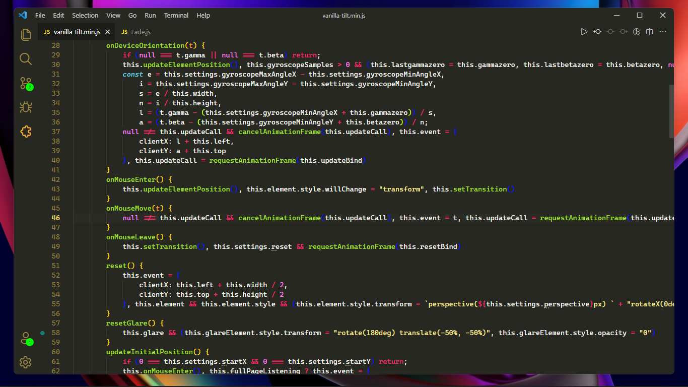

<!-- HTML -->

    

        <h1>Kenkai Theme for Visual Studio Code</h1>
        <h2>For Those who love Monokai, but who wants much more!</h2>
         
        

        KenKai Theme is a dark color theme, mostly based on Monokai Dark Theme. It has a customized user interface theme for Visual Studio Code for Monokai Lovers Who likes More! and I truly hope you like it, If you don't feel free to swith to Monokai Pro or any other Monokai Theme!
        

    

     
    

        
    

    

     
        <h3>and the Bash looks great too!</h3>
     
        
        <h3>I personaly use and recommend Git Bash</h3>
         
        
I use Git Bash with starship, which makes it looks freakin' cool as Hell! I'll provide the link to my starship config file below.

         
    

    

        
        
I used some extentions with the theme too, for this output! Namely, a product icon theme named Fluent Icons 

    

 

    <h2>Here are some useful Links</h2>
    <h3><a href="https://github.com/TheAmalLalgi/KenKai-Theme/blob/main/Assets/Starship.toml">My Starship Configuration File</a></h3>
    <h3><a href="https://github.com/TheAmalLalgi/KenKai-Theme/blob/main/Assets/settings.json">My Visual Studio Code Settings.json File</a></h3>

    <h2>Feel free to contact me or check me out on,</h2>
     
    <ul>
        <li><a href="https://TheAmalLalgi.github.io">My Website</a></li>
        <li><a href="https://www.instagram.com/TheAmalLalgi">Instagram</a></li>
        <li><a href="https://twitter.com/AmalLalgi">Twitter</a></li>
        <li><a href="https://www.linkedin.com/in/amal-lalgi-8b193521a/">LinkedIn</a></li>
        <li><a href="https://www.behance.net/amallalgi">behance</a></li>
        <li><a href="https://github.com/TheAmalLalgi">Github</a></li>
        <li><a href="https://pintrest.com/_u/amallalgi">Pintrest</a></li>
        <li><a href="https://www.deviantart.com/amallalgi">DeviantArt</a></li>
        <li><a href="#">Github Repository for this Theme</a></li>
        <li><a href="mailto:amallalgi2487@gmail.com">Email me at: amallalgi2487@gmail.com</a></li>
    </ul>

<!-- Styling -->

